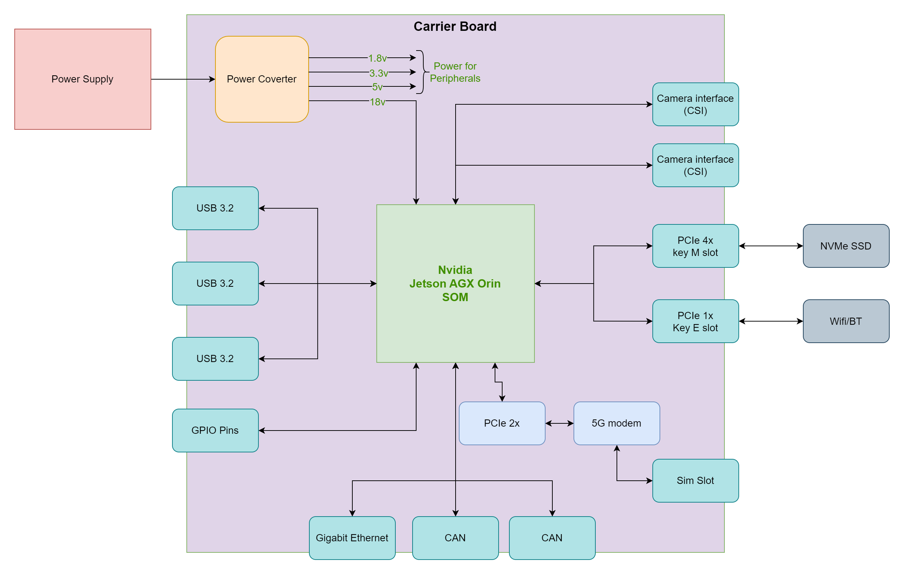

## 3. System Overview

The **H1 – Main Robotics Processing & Communications Unit** is the “brain” of the humanoid robot.
It concentrates all high-performance computing, orchestrates the other electronics units and provides the main interface to the outside world (lab network, cloud, tools).

At a glance, H1:

- Runs the perception, planning and coordination software on a Jetson AGX Orin SOM.
- Connects to the sensor & perception unit (H2), the mobility & manipulation controller (H3) and the power management unit (H4) using Ethernet and CAN.
- Hosts the wireless interfaces (Wi-Fi 6, 5G, Bluetooth) and persistent storage.
- Implements safety modes (Off, Standby, Normal, Limp-Home, Fault) using a dedicated safety/supervisor MCU chain.

### 3.1 H1 Feature Summary (from RFP, realised in H1 design)

| #  | Feature from RFP / System Need                 | Realisation in H1 Design |
|----|------------------------------------------------|---------------------------|
| 1  | Central orchestration / brain                  | Jetson AGX Orin SOM acts as the main compute node running all robotics and AI workloads; it exchanges commands and telemetry with H2 (sensors), H3 (mobility) and H4 (power) over Ethernet and two CAN buses. |
| 2  | High compute CPU+GPU, ≥ 200 TOPS               | Jetson AGX Orin SOM integrates 8× Cortex-A78 CPU cores, an Ampere-based GPU and accelerators (DLA, PVA, HDR ISP, video encode/decode) delivering the required AI TOPS budget for perception, planning and control. |
| 3  | 32 GB memory                                   | The design uses the 32-GB Jetson AGX Orin variant, providing ≥32 GB LPDDR5 memory plus 4 MB system cache to support multi-sensor perception and planning workloads. |
| 4  | Support for camera, lidar, monocular camera    | H1 provides multiple high-bandwidth ports (USB 3.2 and dual MIPI-CSI) that connect to the Intel RealSense head unit, a 2D safety lidar (via USB/Ethernet) and an additional high-resolution monocular camera. The GPU/accelerators and HDR ISP process these streams in real time. |
| 5  | High-bandwidth buses to H2 & H3                | A Gigabit Ethernet interface and **two independent CAN interfaces** provide deterministic, high-bandwidth links. One CAN channel can be dedicated to mobility (H3) and the other to power/BMS or auxiliary devices (H4/other ECUs). |
| 6  | Wi-Fi 6, 5G, Bluetooth                         | An M.2 Key-E slot with PCIe and SDIO hosts the Wi-Fi 6 + BT module; a 5G modem is connected via PCIe x2 and USB 3.2, with SIM socket and RF paths on the carrier. This enables cloud connectivity and links to up to five Bluetooth devices. |
| 7  | Operates on 24 V architecture                  | A power-converter stage accepts the 24 V input from H4 and generates an 18 V rail (if required) plus 5 V, 3.3 V and 1.8 V rails to supply the SOM and peripherals. |
| 8  | Safety / failsafe capability                   | A safety/supervisor MCU chain (S32K116 at system level and an EFM8SB10F2G on the carrier) monitors power rails, button inputs and Jetson heartbeats and asserts safe-state lines (Robot_Enable, STO, Limp_Home) towards H3 as well as power-enable / pre-charge lines towards H4. |
| 9  | External & debug connectivity                  | Multiple USB 3.2 ports, a USB-C service/debug port, Gigabit Ethernet, GPIO header, status LEDs, buzzer, fan control and reset/user buttons are provided on the carrier for development and field servicing. |
| 10 | Persistent storage                             | An M.2 Key-M slot provides an NVMe SSD for OS images, AI models, sensor logs and diagnostics data. |
| 11 | Telemetry & diagnostics                        | CAN and UART links allow H1 to exchange BMS telemetry with H4 and motion/health data with H3; LEDs, buzzer and the USB-C debug interface support board bring-up and field diagnostics. |

---

### 3.2 High-Level H1 Block Diagram

Conceptually, H1 is composed of:

- A **24 V power-input and converter block** that generates all local rails.
- The **Jetson AGX Orin SOM** providing compute, graphics and AI acceleration.
- A **safety/supervisor subsystem** (S32K116 + EFM8 supervisor) managing power sequencing and safety lines.
- **Communications subsystems** (Ethernet, CAN, Wi-Fi, 5G) that link H1 to other units and to external networks.
- **Sensor and storage interfaces** (USB 3.2, CSI cameras, NVMe SSD).
- **Human/service interfaces** (USB-C, LEDs, buttons, buzzer, fan control).

### 3.3 Operating Modes

H1 supports five operating modes, controlled by the safety/supervisor subsystem:

- **Off** – 24 V supply removed; all rails off; actuators held in a safe state by hardware defaults.
- **Standby** – standby rail and supervisors powered; Jetson and high-power loads off; system ready to wake.
- **Normal** – full power applied; Jetson runs AI stack; perception, planning and motion control active; robot operates at nominal performance while safety conditions are satisfied.
- **Limp-Home** – reduced-performance mode used when a non-critical fault is detected (for example partial sensor failure); motion allowed only with limited speed/torque; non-essential loads may be shed.
- **Fault / Emergency Stop** – critical fault or E-Stop; safety lines demand torque-off from H3; 24 V may be disconnected; Jetson logs the event and may shut down; operator must explicitly recover the system.

---