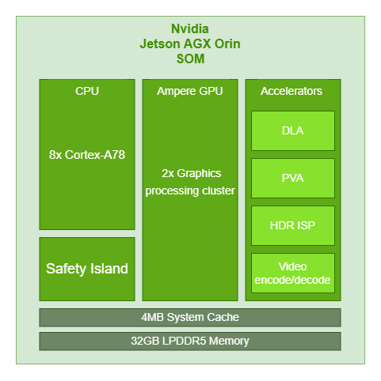

## 4. Hardware Architecture

This section details how H1 is realised in hardware on the carrier board and safety board. It explains the major subsystems, their interfaces and how they work together to fulfil the requirements outlined in Section 3.

---

### 4.1 Main Compute Subsystem (Jetson AGX Orin SOM)

The main compute subsystem is built around an **NVIDIA Jetson AGX Orin SOM**, mounted on a high-density board-to-board connector in the middle of the carrier board.

#### 4.1.1 Processing resources

- 8× ARM Cortex-A78 CPU cores for the operating system, middleware (e.g. ROS2) and control applications.
- An Ampere-architecture GPU with two graphics processing clusters, used for neural-network inference, point-cloud processing and other massively parallel workloads.
- Dedicated accelerators:
  - **DLA** (Deep Learning Accelerators) for efficient inference of CNN models.
  - **PVA** (Programmable Vision Accelerator) for feature extraction and low-level image processing.
  - **HDR ISP** for camera pipeline processing (exposure, demosaicing, colour space conversion).
  - **Video encode/decode engines** for hardware-accelerated streaming and logging of camera feeds.
- Integrated **Safety Island** for local safety monitoring, lockstep execution and diagnostic coverage.
- 32 GB LPDDR5 memory and system cache shared across CPU, GPU and accelerators.

#### 4.1.2 Power integration

- The SOM is powered from a regulated **VIN_SOM** rail (e.g. 18 V) generated by the carrier’s DC-DC converter from the 24 V bus.
- All core voltages (VDD_CPU, VDD_GPU, memory rails, etc.) are generated on the SOM itself; the carrier provides bulk and high-frequency decoupling close to the connector.
- Dedicated power-control signals (`MODULE_POWER_ON`, `MODULE_SHDN_N`, `SYS_RESET_N`) allow the supervisor MCU to sequence power-up and controlled shutdown.

#### 4.1.3 High-speed interfaces

The following high-speed interfaces from the SOM are used in H1:

- **PCIe x4** → M.2 Key-M NVMe SSD.
- **PCIe x1** → M.2 Key-E Wi-Fi 6 + Bluetooth module.
- **PCIe x2** → external 5G modem.
- **USB 3.2 (three ports)** →
  - Head-mounted Intel RealSense camera,
  - 2D safety lidar,
  - spare/service high-speed port on USB-C.
- **Two MIPI-CSI ports** → 22-pin CSI connectors for stereo or monocular cameras.
- **RGMII Ethernet MAC** → Gigabit Ethernet PHY and RJ45 / internal connector.
- **Two CAN controllers** → CAN-FD transceivers and 2-pin connectors.

#### 4.1.4 Low-speed interfaces

- **I²C** buses configure the Ethernet PHY, USB-C/Type-C controllers, power switches and environmental sensors.
- **SPI/UART** links connect to the S32K116 safety MCU and other support devices.
- **GPIO** pins drive status LEDs, read interrupt lines from peripherals and provide fan PWM/tach signals.

#### 4.1.5 Thermal and mechanical considerations

- The SOM is placed to mate with a heat-spreader or heat-sink fixed to the humanoid chassis.
- Fan control (PWM + tach) from the SOM ensures the module stays within thermal limits under peak AI loads.

---

### 4.2 Safety / Supervisor Subsystem (S32K116 MCU)

The safety architecture follows a **two-layer** approach: a local power supervisor on the carrier and a system-level safety MCU.

#### 4.2.1 Carrier Supervisor MCU (EFM8SB10)

The EFM8SB10 on the carrier focuses on **power integrity and controlled sequencing**:

**Inputs**

- Power-good outputs from each DC-DC regulator (24 V input, 18 V, 5 V, 3.3 V, 1.8 V).
- User power button and reset button signals.
- Optional status or commands from the S32K116.

**Outputs**

- `VIN_PWR_ON` – enables the main 24 V → VIN_SOM converter.
- `CARRIER_PWR_ON` – enables secondary regulators for peripherals.
- `MODULE_POWER_ON` and `MODULE_SHDN_N` – request Jetson power-up or shutdown.
- `SYS_RESET_N` – issues a hardware reset to the SOM when needed.

**Behaviour**

- Implements a power-state machine with states **OFF**, **PRECHARGE**, **RUN**, **FAULT**.
- Handles debounce and long-press detection for the power button.
- Ensures that undervoltage or overcurrent conditions result in an orderly shutdown, preventing brown-outs or latch-ups.

#### 4.2.2 System Safety MCU (S32K116)

The S32K116 safety MCU sees the **whole robot**:

**Interfaces**

- UART/SPI + heartbeat GPIO to the Jetson SOM for liveness monitoring and command exchange.
- CAN connection to H3 and H4 for motion and power telemetry.
- Discrete safety lines to H3: `Robot_Enable`, `STO` (Safe Torque Off), `Limp_Home`.
- Digital inputs from E-Stop, safety switches and other external safety circuits.

**Responsibilities**

- Implements the operating mode state machine (Off, Standby, Normal, Limp-Home, Fault).
- Monitors Jetson heartbeat and internal watchdog, triggering a controlled shutdown or fault if the compute stack becomes unresponsive.
- Checks plausibility of BMS data (voltages, currents, temperatures, SoC) received from H4.
- Latches and timestamps safety-relevant events for diagnostics.

#### 4.2.3 Safety Signals and Fail-safe Behaviour

- In **Normal** mode, `Robot_Enable` is high and `STO` is de-asserted, allowing H3 to drive the actuators.
- In **Limp-Home** mode, `Limp_Home` is asserted to request reduced torque and speed; `Robot_Enable` may remain high but H3 interprets the combination as a derated state.
- In **Fault/E-Stop**, `Robot_Enable` is forced low and `STO` is asserted; H3 must respond by disabling torque at the drive level, independently of any software commands.
- Safety inputs and outputs are wired using hardware defaults (pull-downs/pull-ups) so that loss of power or broken wires tends to result in a safe state.

---

### 4.3 Communications & Networking Subsystems

The communications design distinguishes between internal real-time networks and external connectivity.

#### 4.3.1 Internal Real-time Networks

- **Gigabit Ethernet backbone**
  - Jetson RGMII connects to a Gigabit PHY.
  - The PHY links either to an RJ45 jack (for lab use) or to a board-to-board connector that continues to H2/H3.
  - Supports time-synchronised data exchange (e.g. camera frames, motion commands, joint states).

- **CAN / CAN-FD networks**
  - **CAN0** – usually assigned to **H3 Mobility & Manipulation**. Carries:
    - joint set-points and trajectory references,
    - drive feedback (currents, temperatures, faults),
    - drive firmware version and diagnostics.
  - **CAN1** – usually assigned to **H4 Power/BMS and auxiliaries**. Carries:
    - battery voltages, currents and SoC,
    - charger status and power-path information,
    - fault flags (over-voltage, under-voltage, over-temperature).
  - Each bus can be galvanically separated from the SOM side if required by the safety concept.

#### 4.3.2 External Connectivity

- **Wi-Fi 6 + Bluetooth module**
  - M.2 Key-E card connected via PCIe x1 and/or SDIO.
  - Provides a high-bandwidth link to the lab network and Bluetooth connectivity for controllers or wearable devices.
  - Power-enable and reset lines allow the Jetson or supervisor to power-cycle the module to recover from faults.

- **5G modem**
  - Connected via PCIe x2 and USB 3.2, with a SIM slot on the carrier.
  - Multiple RF connectors route to external antennas on the humanoid shell.
  - Used for remote tele-operation, telemetry streaming and OTA updates when Wi-Fi is not available.

#### 4.3.3 Sensor Connectivity

- **USB 3.2 ports** are used for:
  - Intel RealSense depth camera in the head,
  - 2D safety lidar,
  - spare high-speed device (e.g. extra camera or debug dongle).

- **CSI camera ports** connect to:
  - a forward-facing stereo or RGB camera cluster,
  - an optional downward-facing or side-facing monocular camera.

These links are sized so that all required sensors can stream simultaneously while still leaving headroom for logging and control traffic.

---

### 4.4 Storage Subsystem (NVMe, eMMC)

The storage subsystem is designed for both **performance** and **serviceability**.

#### 4.4.1 On-module eMMC

- Contains:
  - boot loaders and secure boot infrastructure,
  - a factory-reset OS image,
  - minimal diagnostics environment.
- Normally used read-only in the field; updates are rare and carefully controlled.

#### 4.4.2 NVMe SSD on M.2 Key-M

- Provides the main high-performance storage:
  - primary root filesystem for day-to-day operation,
  - AI models and configuration data,
  - experiment logs and datasets.
- Typical capacities: 512 GB – 2 TB, selectable depending on product tier.
- Connected via PCIe x4 for high throughput; the PCIe link training and power-good status are monitored so that SSD faults can be detected early.
- Power-switch and enable lines allow:
  - forced power-cycle of the SSD during debug,
  - partial power-down in low-energy modes.

#### 4.4.3 Data Protection Considerations

- Logs can be written to journalling filesystems to reduce corruption risk after hard faults.
- Critical configuration and calibration files are periodically backed up from the SSD to a reserved eMMC partition.

---

### 4.5 Human / Service Interfaces (USB-C, LEDs, Buttons)

Human interaction and servicing are primarily through the carrier’s front-panel interfaces.

#### 4.5.1 USB-C ports

- **USB-C 1 / USB-C 2** – multi-role high-speed ports:
  - default to USB host for connecting external drives, sensors or debug adapters,
  - can be reconfigured as device ports for direct connection to a laptop (mass-storage gadget, USB-Ethernet gadget, etc.).
- **USB-C 3 (Service)** – normally dedicated to engineering use:
  - used to flash OS images, access serial console or recover the system,
  - protected with ESD diodes and current-limited power switches.

Each port is managed by a USB Type-C/PD controller that:

- negotiates orientation and role,
- limits inrush and fault currents,
- reports over-current events to the supervisor or Jetson.

#### 4.5.2 Status LEDs and buzzer

Typical indicators include:

- **POWER** – 24 V and local rails present.
- **RUN** – Jetson has booted and is in Normal mode.
- **FAULT** – safety fault latched; system in Limp-Home or Fault mode.
- **NET** – Ethernet link and activity (integrated into the RJ45).

A small **buzzer** can be driven by the supervisor or Jetson to signal power-up, errors or mode changes (e.g. different beep patterns for Fault vs Limp-Home).

#### 4.5.3 Buttons and fan interface

- **Power button**
  - Short press: request power-up or clean shutdown via the supervisor.
  - Long press (configurable): force transition to Fault or power-cut for recovery in case of software lock-up.

- **Reset button**
  - Generates a supervisor-mediated reset of the Jetson (and optionally some peripherals) without fully depowering the board.

- **Fan control**
  - Jetson PWM output drives the cooling fan.
  - Fan tachometer feedback is monitored; if the fan stalls, the supervisor can limit performance or force shutdown to protect the SOM.

#### 4.5.4 Debug / expansion header

- Provides access to:
  - a UART console for low-level debugging if required,
  - spare GPIO, I²C and power pins for attaching temporary sensors, logic analysers or measurement equipment.

These interfaces ensure that the H1 unit can be assembled, brought up, diagnosed and maintained conveniently throughout the project lifecycle, from hackathon prototype to potential product.