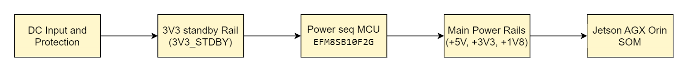

## 5. Power Architecture

### 5.1 24 V Input & DC-DC Power Tree

- **24 V Input from H4**
  - H1 is supplied from the 24 V robot bus provided by H4 (Robotics Power Management Unit).
  - The input path includes connector + reverse-polarity protection and transient suppression (TVS diodes and MOSFET ideal-diode arrangement).

- **Primary Conversion**
  - A primary buck converter stage generates the intermediate **VIN_SOM / 18 V rail** that feeds the Jetson AGX Orin SOM.
  - Two high-current buck regulators generate the **5 V DC-DC** and **3.3 V DC-DC** rails from the 24 V input.

- **Secondary & Standby Rails**
  - A **3.3 V standby LDO** (3V3_STBY) is always present when 24 V is on; it powers:
    - EFM8 supervisor MCU,
    - S32K116 safety MCU (via system harness),
    - wake / button circuitry and key pull-ups.
  - A **1.8 V LDO** generates the rail for CSI level shifters, I/O expanders and other 1.8 V logic.

- **Load Switching**
  - High-side MOSFETs switch the 5 V and SOM supply rails (`+5V_SOM`, etc.) under MCU control, allowing the Jetson and high-power peripherals to be cleanly turned on/off without dropping the whole 24 V bus.

Overall, the tree is:

> 24 V (from H4) → Primary buck → VIN_SOM/18 V → Jetson internal rails
> 24 V → 5 V DC-DC → USB, 5G, Wi-Fi, misc.
> 24 V → 3.3 V DC-DC → logic, Ethernet PHY, CAN, GPIO
> 24 V → 3.3 V_STBY LDO → supervisors & wake logic
> 24 V → 1.8 V LDO → CSI / low-voltage logic

---

### 5.2 Power Rails & Loads (Jetson, Radios, Peripherals)

**Jetson AGX Orin SOM (VIN_SOM / 18 V)**

- Typical operating power:
  - ~30–40 W for moderate robotics workload,
  - configuration-dependent maximum up to ~60 W.
- Uses VIN_SOM as input and locally generates all internal core and memory rails.
- Loads: CPU, GPU, DLAs, memory, Safety Island and on-module support logic.

**5 V Rail**

- Dimensioned for high-current loads (up to ~12 A from the 24 V bus).
- Primary consumers:
  - USB 3.2 ports (sensors, external drives),
  - NVMe SSD (via M.2 Key-M),
  - 5G modem (USB + PCIe),
  - Wi-Fi/BT module (when powered from 5 V then locally regulated),
  - fan and any auxiliary 5 V devices.

**3.3 V Rail**

- High-current 3.3 V DC-DC (up to ~12 A) feeds:
  - Ethernet PHY and magnetics,
  - CAN transceivers,
  - I²C expanders, GPIO expanders, level shifters,
  - control side of power switches, USB-C controllers, LEDs, etc.

**3.3 V_STBY Rail**

- Low-power, always-on rail (~150 mA) for:
  - EFM8 supervisor MCU,
  - pull-ups on power-control lines (`VIN_PWR_ON`, `CARRIER_POWER_ON`, `MODULE_POWER_ON`, etc.),
  - safety / wake inputs and indicators that must work in Standby mode.

**1.8 V Rail**

- 1.8 V LDO (~200 mA capacity) powering:
  - CSI level shifters, I²C multiplexers, GPIO expanders for cameras,
  - other 1.8 V peripherals as required by the sensor stack.

---

### 5.3 Power Sequencing & Control (Supervisor-driven)

Power sequencing is handled by the **EFM8SB10 supervisor MCU** on the H1 carrier, in coordination with the **S32K116 safety MCU** at system level.

**Key control signals (EFM8 ↔ power tree / Jetson)**

- `VIN_PWR_ON` – enables primary DCDC from 24 V to VIN_SOM/18 V.
- `CARRIER_POWER_ON` – enables the 5 V and 3.3 V DC-DC converters.
- `MODULE_POWER_ON` – requests Jetson to power up; works with `MODULE_SHDN_N` and `POWER_BTN_N` for orderly power transitions.
- `SYS_RESET_N` – hardware reset line to Jetson SOM.
- `VDDIN_PWR_BAD_N` – power-good / fault aggregation from the DC-DC converters.

**Sequence (power-up)**

1. 24 V is present; 3.3 V_STBY LDO powers up supervisor logic.
2. EFM8 performs initial checks (button state, any latched faults) and asserts `VIN_PWR_ON`.
3. Once VIN_SOM and intermediate rails are stable, the EFM8 asserts `CARRIER_POWER_ON` to bring up 5 V and 3.3 V.
4. After all power-good signals are valid, EFM8 pulses `MODULE_POWER_ON` / `POWER_BTN_N` to start the Jetson boot sequence.
5. S32K116 monitors Jetson heartbeat and, if valid, allows transition to Normal mode (see Section 6).

**Sequence (shutdown)**

- Initiated by user long-press, software request, or safety fault.
- S32K116 instructs Jetson to shut down; Jetson signals completion or times out.
- EFM8 asserts `MODULE_SHDN_N` / `POWER_BTN_N` as needed, then disables `CARRIER_POWER_ON` and finally `VIN_PWR_ON`, leaving only 3.3 V_STBY active.

---

### 5.4 Power States & Consumption Targets

Approximate electrical behaviour per system mode:

| Mode           | Powered rails                             | Typical Loads                                           | Target Power (H1 only) |
|----------------|--------------------------------------------|--------------------------------------------------------|------------------------|
| **Off**        | None (or minimal sensing on H4 side)       | –                                                      | ~0 W                   |
| **Standby**    | 24 V, 3.3 V_STBY                           | EFM8, S32K116, wake logic, a few LEDs                  | ~0.5–1.5 W             |
| **Normal**     | All rails (VIN_SOM, 5 V, 3.3 V, 1.8 V)     | Jetson at configured TDP, sensors, radios, SSD, fan    | ~60–120 W (config-dep) |
| **Limp-Home**  | All rails, but non-essential loads can be disabled | Jetson at reduced performance, safety-critical sensors only, radios/SSD may be throttled | ~40–80 W |
| **Fault**      | 3.3 V_STBY always on; other rails as needed for logging, then off | Jetson may be forced off, actuators disabled | → Standby after handling |

Exact values depend on final module variants and power-limit configuration of Jetson AGX Orin; the table expresses the design intent and relative differences between modes.

---

### 5.5 Protection & Monitoring

Key protection and monitoring mechanisms:

- **Electrical protection**
  - Input reverse-polarity protection and surge suppression on the 24 V line.
  - TVS diodes on 24 V and key 5 V / 3.3 V rails for transient immunity.
  - Current-limit and fault-flag features of the load switches (e.g. on USB-C, camera and NVMe supplies).

- **Regulator monitoring**
  - Power-good pins from the buck regulators and LDOs are wired to the EFM8, which aggregates them into `VDDIN_PWR_BAD_N` and status bits.
  - If any rail falls outside limits, the supervisor can initiate a controlled shutdown or block further startups.

- **Current and voltage telemetry**
  - H4 BMS provides detailed 24 V bus telemetry (voltage, current, SoC, temperature) to H1 over CAN; S32K116 uses this to enforce derating or shutdown strategies.
  - Optional local current-sense shunts and amplifiers on the 24 V input allow H1 to estimate its own consumption for diagnostics and logging.

- **Thermal management**
  - Fan speed feedback is monitored; loss of airflow can trigger throttling or shutdown.
  - Over-temperature warnings from Jetson and peripherals are exposed to the safety MCU.

- **Diagnostics hooks**
  - Test pads on all major rails (24 V, VIN_SOM, 5 V, 3.3 V, 3.3 V_STBY, 1.8 V) and control lines enable lab measurements and end-of-line testing.
